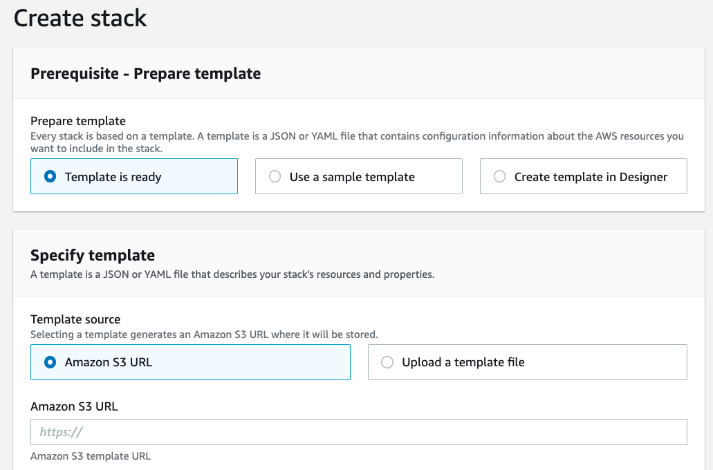
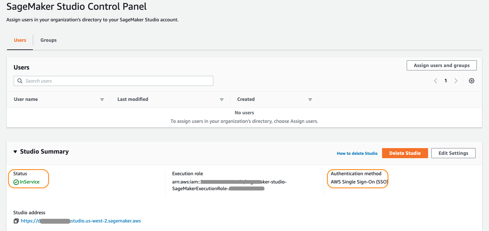
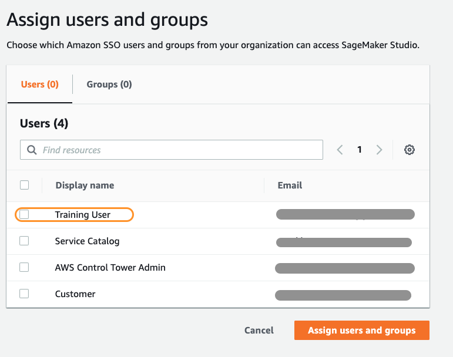

# Launching Amazon SageMaker Studio Domain using AWS Service Catalog and AWS SSO
​
## Table of Contents
- [Launching Amazon SageMaker Studio Domain using AWS Service Catalog and AWS SSO](#launching-amazon-sagemaker-studio-domain-using-aws-service-catalog-and-aws-sso)
  - [Table of Contents](#table-of-contents)
  - [Overview](#overview)
  - [AWS Services used in the solution-](#aws-services-used-in-the-solution-)
      - [AWS Control Tower](#aws-control-tower)
      - [AWS Service Catalog](#aws-service-catalog)
      - [AWS Single Sign-On (SSO)](#aws-single-sign-on-sso)
      - [Amazon SageMaker Studio](#amazon-sagemaker-studio)
      - [AWS CloudFormation](#aws-cloudformation)
      - [Amazon Simple Email Service (SES)](#amazon-simple-email-service-ses)
  - [How to run the workshop?](#how-to-run-the-workshop)
    - [Pre-requisites](#pre-requisites)
    - [Create a Portfolio and Product in Service Catalog](#create-a-portfolio-and-product-in-service-catalog)
    - [Launch Amazon SageMaker Studio from Service Catalog](#launch-amazon-sagemaker-studio-from-service-catalog)
    - [Steps to Access Amazon SageMaker Studio and assign users](#steps-to-access-amazon-sagemaker-studio-and-assign-users)
      - [Access Amazon SageMaker Studio](#access-amazon-sagemaker-studio)
      - [Assign Users](#assign-users)
      - [Delete Users](#delete-users)
  - [Security](#security)
  - [License](#license)
​
## Overview 
​
In this workshop, we want to demonstrate how you can create a Amazon SageMaker Studio domain using AWS Service Catalog and AWS SSO in your AWS Control Tower environment. 

## AWS Services used in the solution-

#### [AWS Control Tower](https://aws.amazon.com/controltower/) 
It provides the easiest way to set up and govern a new, secure, multi-account AWS environment based on best practices established through AWS’ experience working with thousands of enterprises as they move to the cloud. With AWS Control Tower, builders can provision new AWS accounts in a few clicks, while you have peace of mind knowing your accounts conform to your company-wide policies.
​
#### [AWS Service Catalog](https://aws.amazon.com/servicecatalog) 
It allows organizations to create and manage catalogs of IT services that are approved for use on AWS. These IT services can include everything from virtual machine images, servers, software, and databases to complete multi-tier application architectures. It allows you to centrally manage commonly deployed IT services, and helps you achieve consistent governance and meet your compliance requirements, while enabling users to quickly deploy only the approved IT services they need.
​
#### [AWS Single Sign-On (SSO)](https://aws.amazon.com/single-sign-on/)   
It makes it easy to centrally manage access to multiple AWS accounts and business applications and provide users with single sign-on access to all their assigned accounts and applications from one place. With AWS SSO, you can easily manage access and user permissions to all of your accounts in AWS Organizations centrally.
​
#### [Amazon SageMaker Studio](https://docs.aws.amazon.com/sagemaker/latest/dg/gs-studio.html) 
It is the first fully integrated development environment (IDE) for machine learning (ML). It provides a single, web-based visual interface where you can perform all ML development steps required to build, train, tune, debug, deploy, and monitor models. 
​
#### [AWS CloudFormation](https://docs.aws.amazon.com/AWSCloudFormation/latest/UserGuide/Welcome.html) 
It gives you an easy way to model a collection of related AWS and third-party resources, provision them quickly and consistently, and manage them throughout their lifecycle, by treating infrastructure as code.
​
#### [Amazon Simple Email Service (SES)](https://aws.amazon.com/ses/) 
It is a cost-effective, flexible, and scalable email service that enables developers to send mail from within any application. With Amazon SES, you can send email securely, globally, and at scale.
​
## How to run the workshop?
​
**Note:** Although the workshop code can be used to launch Amazon SageMaker Studio without Control Tower, but this workshop is focused on launching it in a `AWS Control Tower Environment`. 
If you plan to use it without AWS Control Tower, then refer to the following blog post for details: 
[Creating Amazon SageMaker Studio domains and user profiles using AWS CloudFormation](https://aws.amazon.com/blogs/machine-learning/creating-amazon-sagemaker-studio-domains-and-user-profiles-using-aws-cloudformation/)
​
### Pre-requisites

- AWS Control Tower should be set up. If its not, please follow the steps provided [here](https://controltower.aws-management.tools/core/overview/) to launch AWS Control Tower. 
- At least two existing accounts associated with Users in the AWS SSO. You can follow the steps [here](https://controltower.aws-management.tools/core/accountfactory/) to launch a new account and create a new user in AWS SSO (only steps 1 & 2).
- Make sure you don't have an existing Studio domain in your account, because at the time of writing this workshop, an AWS account is limited to one domain per region. Creating an extra domain will cause an error to occur. 
- (Optional) This is required only if you want to set up notifications, otherwise you can skip it. 
  - Set up and verify an email address in Amazon SES from where the users will recieve an email when the Amazon SageMaker Studio acess is granted or revoked. You can follow the steps [here](https://docs.aws.amazon.com/ses/latest/DeveloperGuide/quick-start.html) for the set up. ***NEEDS MORE INFO: which email to verify? each account or the root account we used to setup the portofolio?***
  
### Create a Portfolio and Product in Service Catalog
​
We will use AWS CloudFormation to launch the portfolio and product in the AWS Service Catalog, therefore, we would need to upload it to S3 as outlined in the steps below. 
- Login to **AWS Management console** with an `admin account` for the **AWS Control Tower** instance. 
- Upload the folders: `templates` and `code` in your `S3 bucket`. Create a new one in the account if necessary.
- (Optional) Make sure your S3 bucket is versioned.
- Go to `CloudFormation` service in your account. 
- On the left hand navigation navigate to `Stacks`. 
- Click on the `Create Stack` drop down on the top right hand side dropdown and select `With new resources (standard)`.
- Provide the S3 object link for `aws-workshop-deployment-template.yaml` in the `Amazon S3 URL` text box as shown in the screenshot below. It should be located in the `templates` folder.
- 
  
​
- Click on `Next` button. 
- Provide the `S3 bucket name` in the `Step 2 Specify stack details` screen. 
- Leave everything default on `Step 3 Configure stack options` screen and click `create stack` button in `Step 4 Review` screen after reviewing the necessary details.
- ​This will create a new portfolio with name `Data Science Tools` and a product `Amazon SageMaker Studio` in your account. Once, the CloudFormation stack is complete, you can go to Service Catalog and launch your product.
​
### Launch Amazon SageMaker Studio from Service Catalog

- From **AWS Management Console** go to **Service Catalog**. 
- Click on `Portfolios` in the left hand navigation. 
- Click on `Data Science Tools` portfolio to go to **Portfolio details** page.
- Click on `Groups, roles, and users` tab, and then 'Add groups, roles, users' button. 
- On `Add groups, roles, and users access to portfolio` screen, click on `Roles` tab. 
- Select the role starting with `AWSReservedSSO_AWSAdministratorAccess_` and click on `Add access` button on the top right hand side. 
- Navigate to `Products` on the left hand navigation. Now you will see `Amazon SageMaker Studio` product on the `Products` screen. 
- Select `Amazon SageMaker Studio` and click on `Launch product` button, follow the steps on the subsequent screen, this will launch `Amazon SageMaker Studio` in your account in `SSO` auth mode. 
  
Once its launched you can see it under the `Provisioned products` section with status `Available`. 
__
You can now access your new `Amazon SageMaker Studio domain` in the `SageMaker` section in the `AWS Management Console`. In the console, you can click on `Assign users` to grant access to the studio domain. The new users will recieve an email whenever an access is granted or revoked from them. 
​
### Steps to Access Amazon SageMaker Studio and assign users
#### Access Amazon SageMaker Studio
___
 - From **From AWS Management Console** go to **Amazon SageMaker**. 
 - On the left hand navigation click on `Amazon SageMaker Studio`. 
 - Under the `Studio Summary` verify the following: 
   -  `Status` should be `InService`.
   -  `Authentication method` as `AWS Single Sign-On (SSO)`. 
- 
   -  Copy the Studio Address and save it separately, you can use it to share with your users whom you will grant access in the next step, that way they can access `Amazon SageMaker Studio` directly. 
  
#### Assign Users 
___
 - On the top left corner under the SageMaker Studio Control Panel, click on `Assign users and groups`. 
 - Select the user(s) that you want to grant access to, and click on `Assign users and groups` button. 
 - 
 - If the notifications have been configured as mentioned in the pre-requisites the user will get the email. 
#### Delete Users
___
Repeat the following steps for each user in the User name list.
- Choose the user.
- On the User Details page, for each non-failed app in the Apps list, choose Delete app.
- On the Delete app dialog, choose Yes, delete app, type delete in the confirmation field, and then choose Delete.
- When the Status for all apps show as Deleted, choose Delete user.
​
___
_Important:_
When a user is deleted, they lose access to the Amazon EFS volume that contains their data, including notebooks and other artifacts.

## Security
​
See [CONTRIBUTING](CONTRIBUTING.md#security-issue-notifications) for more information.
​
## License
​
This library is licensed under the MIT-0 License. See the LICENSE file.